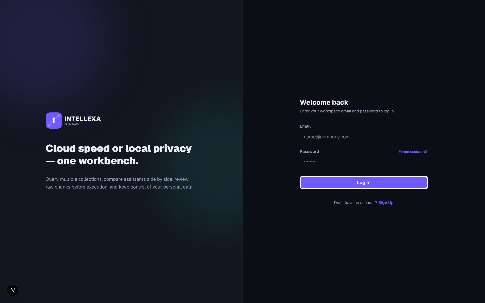
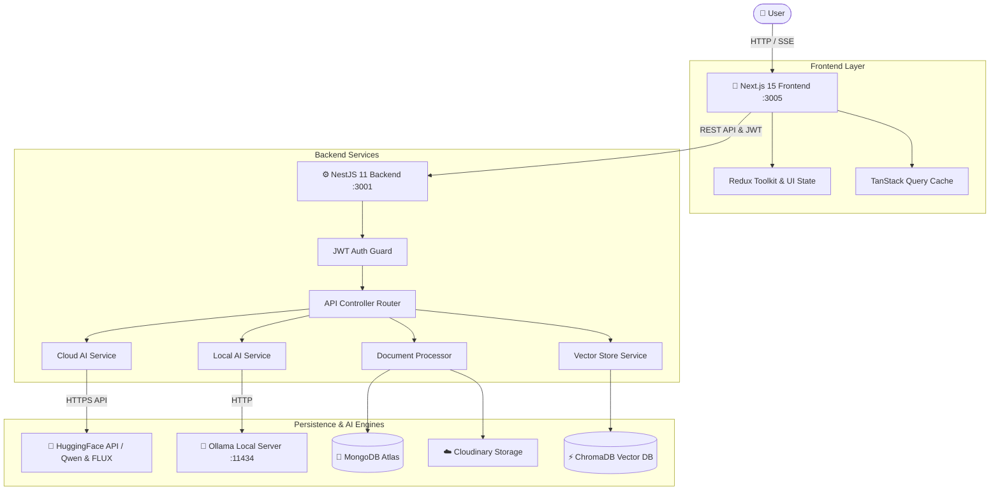
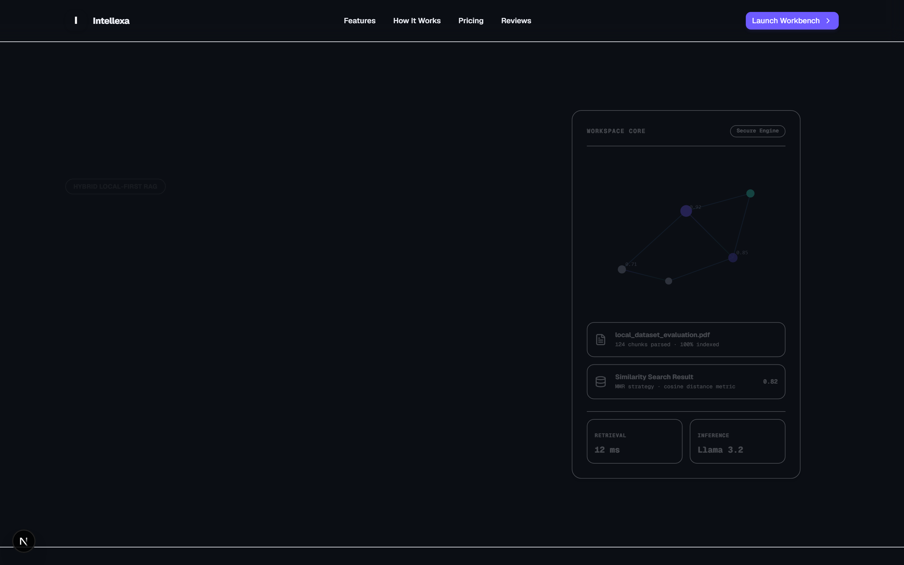
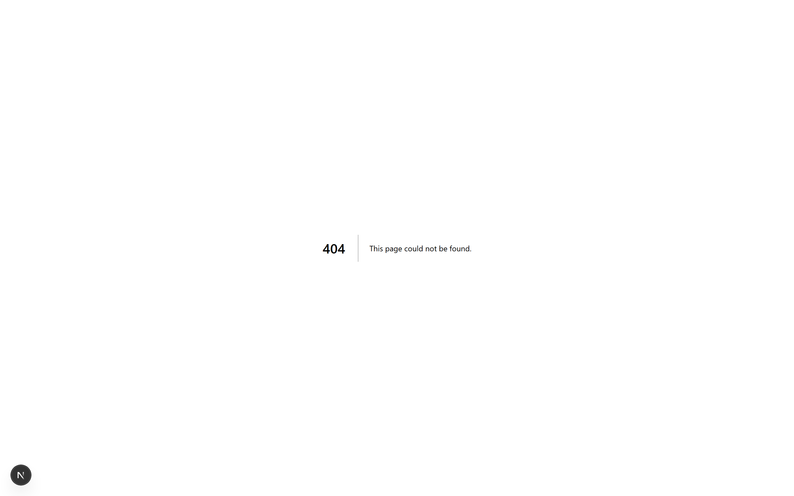
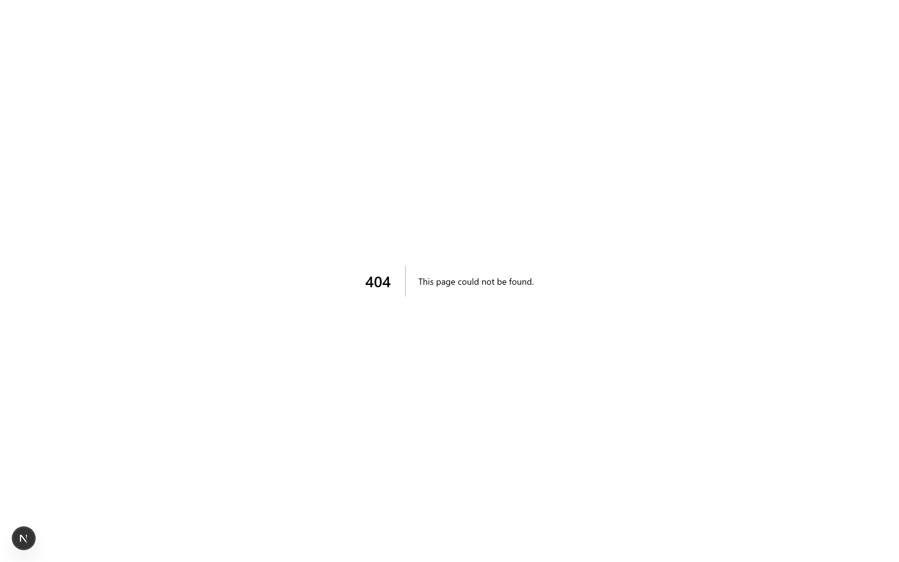
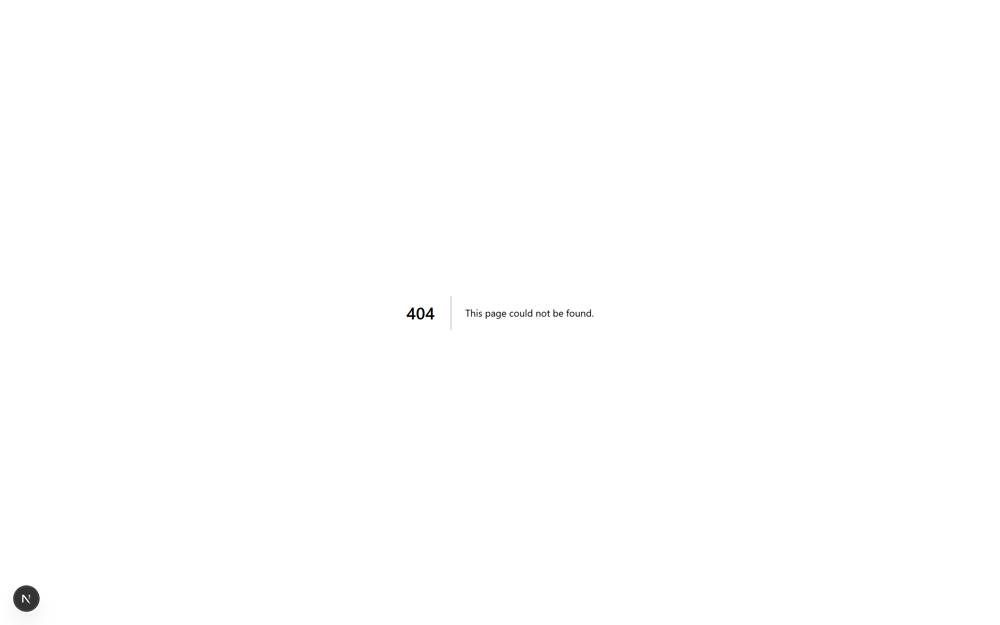
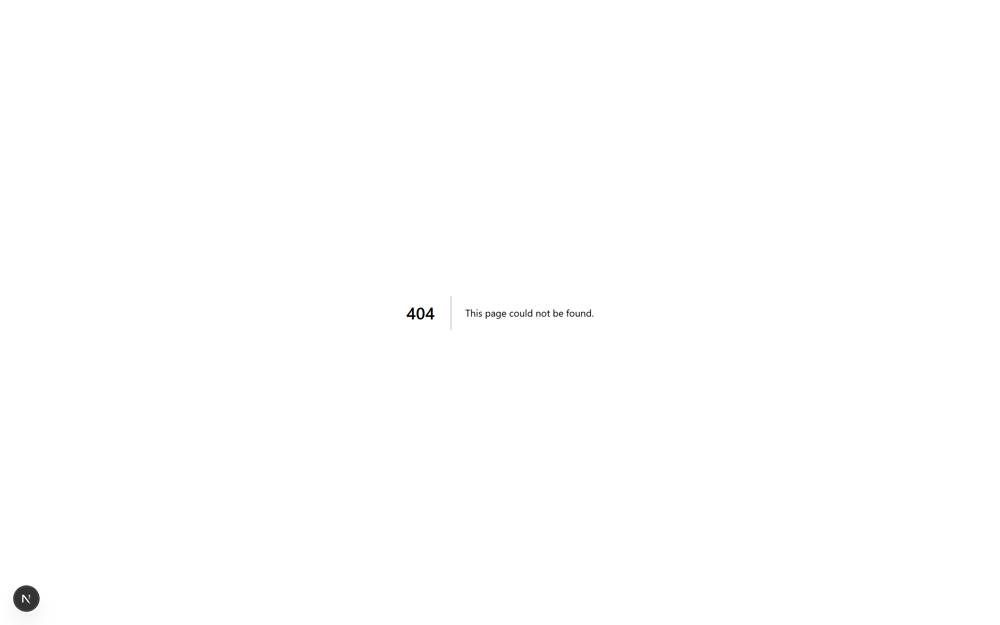
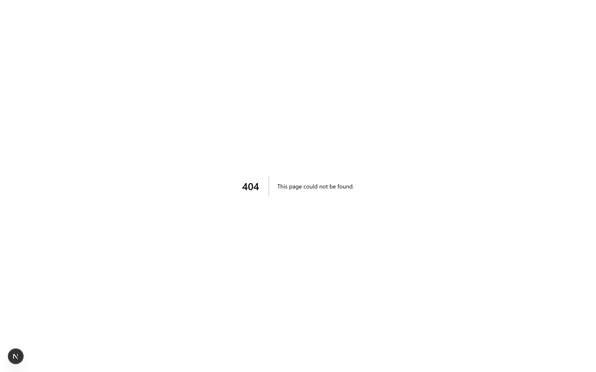

# Intellexa 🚀

<div align="center">



### **Dual-Mode AI Workspace — Cloud Speed meets 100% Local Privacy with Retrieval-Augmented Generation (RAG)**

[](https://nextjs.org/)
[](https://react.dev/)
[](https://nestjs.com/)
[](https://www.typescriptlang.org/)
[](https://tailwindcss.com/)
[](https://www.trychroma.com/)
[](https://ollama.com/)
[](https://huggingface.co/)
[](LICENSE)

---

[Key Features](#-key-features) •
[Architecture](#-architecture--data-flow) •
[Visual Tour](#-visual-interface-tour) •
[Quick Start](#-quick-start) •
[Environment Variables](#-environment-variables) •
[API Reference](#-api-endpoint-reference) •
[Directory Structure](#-directory-structure)

</div>

---

## 💡 Overview

**Intellexa** is a full-stack, enterprise-grade AI research workspace designed to combine high-performance cloud LLM capabilities with 100% private, local document intelligence. 

Whether you need instant cloud inference via HuggingFace models or complete zero-data-leakage RAG (Retrieval-Augmented Generation) on confidential documents using local Ollama models and ChromaDB vector stores, Intellexa provides a unified, state-of-the-art workbench.

### 🌟 Why Intellexa?

| Capability | ☁️ Cloud AI Mode | 🔒 Local RAG AI Mode |
| :--- | :--- | :--- |
| **Primary Engine** | HuggingFace Inference API (`Qwen2.5-72B`, `Llama-3`) | Local Ollama Instance (`llama3.2`) |
| **Document Awareness** | General Knowledge & Web Intelligence | Full Vector RAG over uploaded documents |
| **Data Privacy** | Encrypted API Transmission | **100% Offline & Private (Zero External API Calls)** |
| **Embeddings & Search** | N/A | Local ChromaDB with `nomic-embed-text` |
| **Citations & Debugging**| Standard AI Responses | Real-time Source Snippet Attribution & RAG Debug Panel |
| **Multimodal Features** | Text-to-Image (FLUX.1) & Speech-to-Text (Whisper) | Document Parsing (PDF, DOCX, TXT, MD) & Diffing |

---

## ✨ Key Features

### ☁️ Cloud AI Services
- **Real-Time Streaming Responses**: Instant response generation using HuggingFace's top-tier models (`Qwen/Qwen2.5-72B-Instruct`).
- **Interactive System Prompt & Parameters**: Full control over LLM behavior with dynamic hyperparameter adjustments:
  - `Temperature`: Adjust creativity vs. precision.
  - `Top-P`: Nucleus sampling threshold.
  - `Max Tokens`: Dynamic response length output control.
- **Multimodal AI Capabilities**:
  - **Text-to-Image Generation**: Generate high-fidelity visual concepts using `FLUX.1-schnell`.
  - **Speech-to-Text Transcription**: Upload or record audio streams transcribed instantly via OpenAI's `Whisper-large-v3`.
- **Prompt Library & Quick Starters**: One-click prompt suggestions tailored for legal analysis, code review, academic research, and summary drafting.

### 🔒 Local RAG & Vector Engine
- **Private Offline Conversations**: Query local LLMs (`llama3.2`) running via Ollama without any data leaving your local environment.
- **Semantic Vector Retrieval**: Powered by ChromaDB using state-of-the-art embeddings (`nomic-embed-text`).
- **Granular Retrieval Controls**:
  - Dynamic `Top-K` document chunk retrieval count.
  - Configurable `Minimum Similarity Score` thresholds.
  - Multiple retrieval strategies (Cosine Similarity, Maximal Marginal Relevance - MMR).
- **Automated Source Attribution**: Every response generated via RAG displays clickable citation chips showing source document name, exact page/chunk reference, and confidence score.
- **Interactive RAG Debug Panel**: Inspect retrieved context chunks, vector distances, raw text snippets, and relevance scores in real-time.

### 📄 Document Processing Engine
- **Multi-Format Ingestion**: Ingest PDF, DOCX, TXT, and Markdown (`.md`) files up to **50MB** each.
- **Intelligent Chunking Strategy**: Automated text extraction with configurable segment sizes and chunk overlaps.
- **Background Vector Indexing**: Parallel embedding generation with progress tracking.
- **Smart Document Diffing**: Automatic content comparison and delta detection when re-uploading modified files.
- **Lifecycle Management**: Instant document re-indexing, download, and clean deletion from both storage and vector databases.

### 📁 Vector Collection Partitioning
- **Isolated Vector Workspaces**: Partition vector storage across multiple collections to prevent context cross-contamination.
- **Collection Management**: Create, edit, and categorize custom research collections (e.g., *Legal Contracts*, *Financial Reports Q3*, *Technical Specs*).
- **Default Provisioning**: Automatic creation of a "General Research" workspace collection for rapid onboarding.

### 📊 Analytics & Telemetry Dashboard
- **System Performance Graphs**: Interactive charts tracking average search latency (ms) and LLM generation response speeds.
- **Retrieval Confidence Score Distribution**: Visual bar graphs displaying vector search relevance distributions.
- **Live Activity Feed**: Real-time log of workspace events (document uploads, re-indexing, collection updates, and chat history).
- **Interactive Onboarding Checklist**: Guided step-by-step setup for new workspace members.

### ⚙️ Workspace Administration & UI/UX
- **User Profile & Cloudinary Integration**: Manage user profiles and upload custom high-resolution avatars via Cloudinary integration.
- **Global Command Palette (`Ctrl + K` / `Cmd + K`)**: Instantly search features, change active views, manage documents, or run quick actions from anywhere in the application.
- **Storage & API Usage Meters**: Visual usage indicators monitoring total storage space, vector count, and API query limits.
- **Dynamic Theme Support**: Modern, responsive UI with Dark and Light mode themes powered by DaisyUI and TailwindCSS.

---

## 🏗 Architecture & Data Flow

Intellexa is built on a clean, modular 3-tier architecture:

```
Intellexa Workspace
├── 🎨 frontend/        # Next.js 15 (App Router) + React 19 + Redux Toolkit + TanStack Query (Port 3005)
├── ⚙️ backend/         # NestJS 11 + Mongoose + Passport JWT Auth + Multer (Port 3001)
├── 📦 shared/          # Shared TypeScript Interfaces, DTOs, and Constants
└── 🗄️ vector-db/       # ChromaDB Vector Database Instance (Port 8000 / Embedded fallback)
```

### End-to-End Data Flow Diagram



---

## 🖼 Visual Interface Tour

### 1. Landing & Overview Hero
The front door to Intellexa, introducing users to dual-mode AI capabilities and seamless workspace authentication.


---

### 2. Analytics & Workspace Dashboard
Real-time dashboard providing instant visibility into response speeds, document vector distributions, recent activities, and search metrics.


---

### 3. Cloud AI Assistant
Streaming conversation view connected to HuggingFace LLMs with system prompt configuration, creativity tuning, prompt templates, image generation, and audio transcription.


---

### 4. Local RAG Assistant & Debug Panel
100% private LLM chat over custom documents with live source citations, confidence scores, and an expandable RAG Debug Panel for vector inspection.


---

### 5. Document Processing Workbench
Upload, manage, and inspect ingested documents (PDF, DOCX, TXT, MD) with chunk counts, vector indexing statuses, re-indexing controls, and diffing tools.


---

### 6. Vector Collection Partitioning Hub
Organize workspace documents into isolated vector collections with independent similarity databases.


---

### 7. System Settings & Usage Telemetry
Configure API keys, Ollama service endpoints, default retrieval strategies, avatar uploads, and monitor workspace usage meters.


---

## 🚀 Quick Start

### Prerequisites

Ensure you have the following installed on your machine:
- **Node.js**: `v24.0.0` or higher
- **npm**: `v10.0.0` or higher
- **MongoDB**: Local MongoDB instance or MongoDB Atlas Connection URI
- **Ollama** *(Optional for local AI mode)*: [Download Ollama](https://ollama.com/)

---

### 1. Repository Setup

```bash
# Clone the repository
git clone https://github.com/your-username/Intellexa.git
cd Intellexa

# Install all dependencies (Frontend & Backend)
npm run install:all
```

---

### 2. Environment Configuration

Create a `.env` file inside the `backend/` directory:

```bash
cp backend/.env.example backend/.env
```

Edit `backend/.env` with your credentials (see [Environment Variables](#-environment-variables) below).

---

### 3. Local AI Engine Setup (Ollama)

If you plan to use Local RAG Chat:

```bash
# Install required local LLM and embedding models
ollama pull llama3.2
ollama pull nomic-embed-text

# Ensure Ollama server is running
ollama serve
```

---

### 4. Launch the Development Workbench

Run both frontend and backend concurrently from the project root:

```bash
npm run dev
```

- **Frontend**: Accessible at [http://localhost:3005](http://localhost:3005)
- **Backend API**: Accessible at [http://localhost:3001/api](http://localhost:3001/api)

---

### 🐳 Docker Deployment

Alternatively, you can run the entire Intellexa stack using Docker Compose:

```bash
# Build and start services in background
docker-compose up -d --build
```

---

## 🔧 Environment Variables

### Backend Configuration (`backend/.env`)

| Variable | Description | Default / Example | Required |
| :--- | :--- | :--- | :---: |
| `PORT` | NestJS server port | `3001` | Yes |
| `JWT_SECRET` | Secret key for JWT token signing | `your-secure-jwt-secret` | Yes |
| `MONGODB_URI` | MongoDB connection string | `mongodb://localhost:27017/intellexa` | Yes |
| `HF_TOKEN` | HuggingFace API access token | `hf_xxxxxxxxxxxxxxxxxxxx` | Yes |
| `HF_CHAT_MODEL` | Cloud chat LLM model repository | `Qwen/Qwen2.5-72B-Instruct` | Yes |
| `HF_IMAGE_MODEL` | Cloud text-to-image model | `black-forest-labs/FLUX.1-schnell` | No |
| `HF_SPEECH_MODEL` | Cloud speech-to-text model | `openai/whisper-large-v3` | No |
| `OLLAMA_HOST` | Ollama local service URL | `http://localhost:11434` | No |
| `OLLAMA_CHAT_MODEL` | Local chat LLM model name | `llama3.2` | No |
| `OLLAMA_EMBEDDING_MODEL`| Local embedding model name | `nomic-embed-text` | No |
| `CHROMA_HOST` | ChromaDB vector store URL | `http://localhost:8000` | No |
| `CLOUDINARY_CLOUD_NAME` | Cloudinary cloud identifier | `your-cloudinary-name` | No |
| `CLOUDINARY_API_KEY` | Cloudinary API Key | `your-api-key` | No |
| `CLOUDINARY_API_SECRET` | Cloudinary API Secret | `your-api-secret` | No |

---

## 📡 API Endpoint Reference

### Authentication Endpoints
- `POST /api/auth/signup` - Register a new workspace user account.
- `POST /api/auth/login` - Authenticate user and receive JWT session.
- `GET /api/auth/me` - Fetch authenticated user profile and settings.

### AI & Assistant Endpoints
- `POST /api/chat` - Cloud LLM streaming conversation (HuggingFace).
- `POST /api/local/chat` - Local RAG streaming conversation (Ollama + ChromaDB).
- `POST /api/local/retrieve` - Retrieve semantic document chunks without full generation.
- `POST /api/image` - Text-to-image generation via FLUX.1 model.
- `POST /api/speech` - Audio transcription via Whisper model.

### Document Management Endpoints
- `GET /api/documents` - Fetch list of uploaded documents in workspace.
- `POST /api/documents/upload` - Ingest document file (PDF, DOCX, TXT, MD up to 50MB).
- `POST /api/documents/reindex` - Trigger vector re-chunking and re-embedding.
- `GET /api/documents/download/:id` - Download original uploaded document file.
- `DELETE /api/documents/:id` - Delete document and purge vectors from ChromaDB.
- `GET /api/documents/stats` - Fetch aggregate storage and document statistics.

### Collection Endpoints
- `GET /api/collections` - List all document collections in workspace.
- `POST /api/collections` - Create a new vector collection.
- `PATCH /api/collections/:id` - Update collection title, description, or assigned files.
- `DELETE /api/collections/:id` - Delete collection and disassociate documents.

### Workspace & Analytics Endpoints
- `GET /api/search?q=:query` - Perform cross-collection global search.
- `GET /api/activity` - Fetch workspace activity event stream.
- `GET /api/notifications` - Retrieve user system notifications.
- `GET /api/usage/meter` - Fetch storage and API consumption metrics.
- `PATCH /api/profile` - Update profile details and settings.
- `POST /api/profile/avatar` - Upload profile avatar image to Cloudinary.

---

## 📁 Directory Structure

```
Intellexa/
├── 📄 BRD_Intellexa.md           # Business Requirements & Specifications
├── 📄 README.md                  # Master Workspace Documentation
├── 📄 docker-compose.yml         # Container Orchestration Spec
├── 📁 docs/
│   └── 📁 assets/               # Application Screenshots & Media
├── 📁 shared/                    # Shared TypeScript Types & DTOs
│   └── 📄 types.ts
├── 📁 backend/                   # NestJS Server Application
│   └── 📁 src/
│       ├── 📁 auth/             # JWT Authentication & Strategy
│       ├── 📁 controllers/      # REST API Route Handlers
│       ├── 📁 services/         # Business Logic & AI Integrations
│       │   ├── 📄 cloud-ai.service.ts
│       │   ├── 📄 local-ai.service.ts
│       │   ├── 📄 document-processor.service.ts
│       │   └── 📄 vector-store.service.ts
│       └── 📁 schemas/          # MongoDB Mongoose Schemas
└── 📁 frontend/                  # Next.js 15 Web Application
    └── 📁 src/
        ├── 📁 app/              # App Router Pages & Layouts
        ├── 📁 components/       # Modern UI Views & Components
        │   ├── 📄 CloudAssistantView.tsx
        │   ├── 📄 LocalAssistantView.tsx
        │   ├── 📄 DashboardView.tsx
        │   ├── 📄 DocumentsView.tsx
        │   ├── 📄 CollectionsView.tsx
        │   ├── 📄 SettingsView.tsx
        │   ├── 📄 CommandPalette.tsx
        │   └── 📁 dashboard/
        ├── 📁 redux/            # Redux Toolkit Slices & Store
        └── 📁 utils/            # API Client & Web Speech Utils
```

---

## 📜 License

This project is licensed under the [MIT License](LICENSE).

---

<div align="center">
  <sub>Built with ❤️ by the Intellexa Engineering Team</sub>
</div>